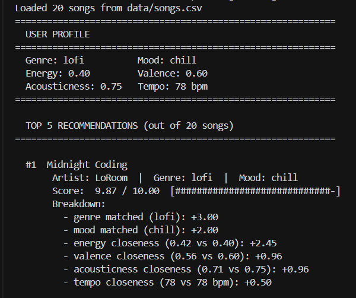
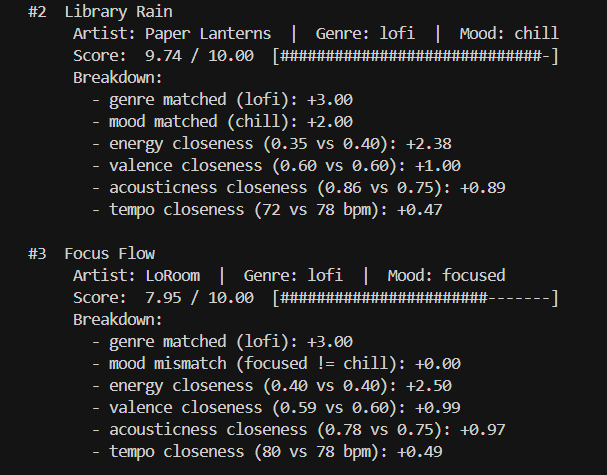
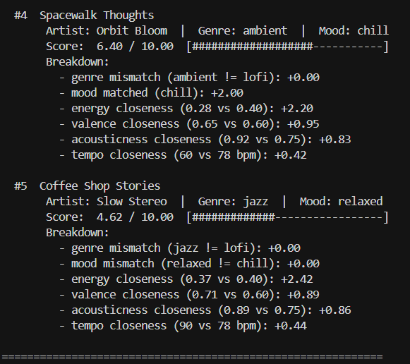
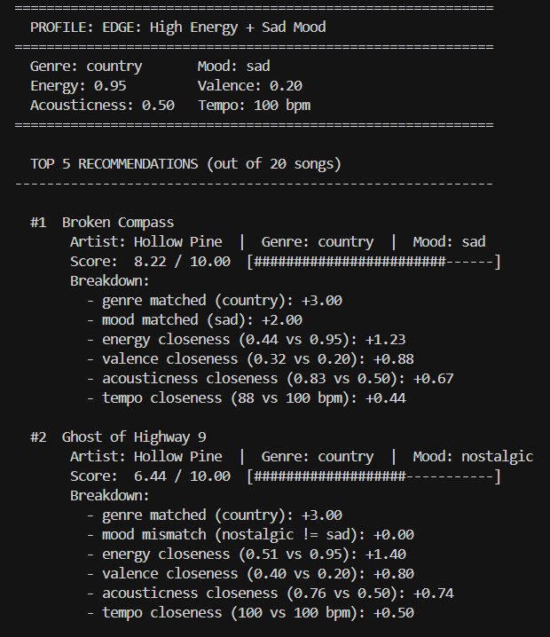
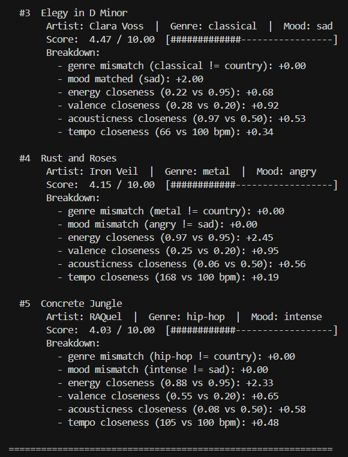
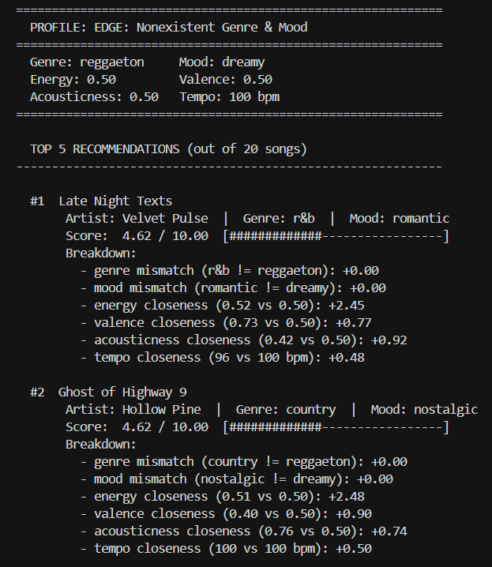
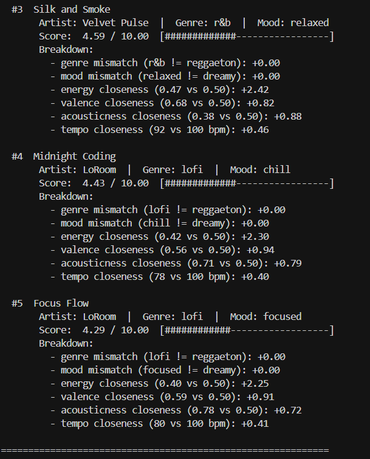

# 🎵 Music Recommender Simulation

## Project Summary

In this project you will build and explain a small music recommender system.

Your goal is to:

- Represent songs and a user "taste profile" as data
- Design a scoring rule that turns that data into recommendations
- Evaluate what your system gets right and wrong
- Reflect on how this mirrors real world AI recommenders

Replace this paragraph with your own summary of what your version does.

---

## How The System Works

Real-world recommenders like Spotify and YouTube combine two broad strategies: collaborative filtering, which finds patterns across millions of users' behaviors to suggest what similar listeners enjoyed, and content-based filtering, which analyzes the attributes of songs a user already likes to find more of the same. Production systems blend both approaches with deep learning, processing billions of implicit signals (plays, skips, listen duration) to generate candidates, rank them, and re-rank for diversity.

Our simulation focuses on the content-based side. Each `Song` carries six scorable features: `genre`, `mood`, `energy`, `valence`, `acousticness`, and `tempo_bpm`. A `UserProfile` stores a preferred genre, mood, target energy level, target valence, target acousticness, target tempo, and an acoustic preference flag.

### Algorithm Recipe

The `Recommender` scores every song on a **0 to 10 point scale** using this formula:

**Categorical features** (binary match — full points or zero):

| Feature | Points | Why this weight |
|---|---|---|
| Genre match | +3.0 | Strongest signal — defines the sonic identity (instruments, production, structure) |
| Mood match | +2.0 | Distinguishes *when* a song fits; two lofi tracks can serve very different moments |

**Numerical features** (closeness — `(1 - |user_target - song_value|) × weight`):

| Feature | Max points | Why this weight |
|---|---|---|
| Energy | ×2.5 | Core vibe axis — the single largest feel difference between songs in the catalog |
| Valence | ×1.0 | Emotional tone — separates brooding from bright within similar energy ranges |
| Acousticness | ×1.0 | Production texture — acoustic coffee-shop feel vs. electronic club feel |
| Tempo | ×0.5 | Weakest solo signal; normalized by BPM range (60–168 = 108 span) to prevent raw BPM gaps from dominating |

**Score budget**: categorical features control 50% of the ceiling (5.0 pts), numerical features control the other 50% (5.0 pts). A perfect genre + mood match gets a song halfway; the numerical closeness scores decide the final ranking among categorical peers.

**Ranking**: after all songs are scored, sort descending and return the top-k (default 5).

### Expected Biases and Limitations

- **Genre dominance**: at 3.0 points (30% of max score), genre is the heaviest single feature. A non-matching genre song needs near-perfect scores on every other dimension to compete with even a mediocre genre match. This creates a filter-bubble effect — a lofi listener will rarely see jazz recommendations even when the jazz track's energy, valence, and acousticness are a closer fit.
- **Mood rigidity**: mood is categorical (match or miss), but real moods exist on a spectrum. "Chill" and "relaxed" feel similar to a listener, yet our system treats them as completely different, awarding zero points for a near-miss.
- **No discovery mechanism**: the system only rewards closeness to existing preferences. It has no way to introduce variety or surprise, which real recommenders handle through exploration strategies and diversity re-ranking.
- **Single-profile assumption**: the system models each user as having one fixed taste. Real listeners shift between moods (workout vs. sleep vs. focus), but our profile has no context awareness.
- **Small catalog bias**: with only 20 songs and 11 genres, most genres have 1–2 representatives. A genre match filter effectively pre-selects 1–2 songs, giving the numerical features very little ranking work to do.

### Sample Output

Below is the terminal output from running the recommender with a lofi/chill user profile:







### Stress Testing with Diverse Profiles

To probe the scoring logic for weaknesses, we ran two adversarial user profiles designed to surface unexpected behavior:

**Edge Case 1 — High Energy + Sad Mood** (`energy: 0.95`, `mood: sad`, `genre: country`). This profile deliberately contradicts itself: high energy paired with a sad mood. The goal is to see whether the categorical genre/mood bonus can be "tricked" by numeric closeness or vice versa.





*Finding*: "Broken Compass" (country/sad, energy 0.44) wins at 8.22 despite terrible energy alignment, because the +5.0 categorical bonus dominates. Meanwhile "Rust and Roses" (metal/angry, energy 0.97) has near-perfect energy but only scores 4.15 — confirming that **genre + mood carry disproportionate weight and numeric closeness alone cannot overcome categorical mismatches**.

**Edge Case 2 — Nonexistent Genre & Mood** (`genre: reggaeton`, `mood: dreamy`). Neither value exists in our 20-song catalog, so every song receives +0 for both categorical features, capping the theoretical max at 5.0.





*Finding*: All top-5 songs land in a narrow 4.29–4.62 band. R&B, country, and lofi tracks score nearly identically — the system degrades gracefully (no crashes, no negative scores) but **the recommendations feel arbitrary without categorical anchors to differentiate songs**.

---

## Getting Started

### Setup

1. Create a virtual environment (optional but recommended):

   ```bash
   python -m venv .venv
   source .venv/bin/activate      # Mac or Linux
   .venv\Scripts\activate         # Windows

2. Install dependencies

```bash
pip install -r requirements.txt
```

3. Run the app:

```bash
python -m src.main
```

### Running Tests

Run the full test suite with:

```bash
pytest tests/
```

To run a specific test file:

```bash
pytest tests/test_recommender.py
```

To see verbose output with individual test names:

```bash
pytest -v
```

---

## Experiments We Tried

**Mood Sensitivity Experiment**: We temporarily disabled the mood scoring component (the +2.0 categorical bonus) and re-ran all three user profiles to observe how rankings shifted. Key findings:

- For the chill lo-fi listener, Focus Flow (mood: focused) jumped from #3 to #1, revealing that its energy and acousticness were a closer numeric fit all along — the mood bonus had been masking that.
- For the high-energy sad profile, Elegy in D Minor dropped out of the top 5 entirely once its mood bonus was removed, replaced by Storm Runner — a track with better energy alignment but no emotional relevance.
- For the nonexistent-genre profile, results were identical in both runs, serving as a control that confirmed the experiment was only changing one variable.

See the [Model Card](model_card.md) (sections 6 and 7) for a deeper analysis of what these results mean.

---

## Limitations and Risks

- **Genre dominance**: genre carries 30% of the max score, making it nearly impossible for a non-matching genre song to rank highly regardless of how well its other features fit.
- **Mood rigidity**: mood is all-or-nothing — near-miss moods like "chill" and "relaxed" get zero credit, creating filter bubbles around exact labels.
- **No discovery**: the system only rewards closeness to existing preferences with no mechanism for exploration or diversity.
- **Single profile per user**: real listeners shift moods (workout vs. sleep vs. focus), but the system has no context awareness.
- **Small, Western-skewed catalog**: 20 songs across 14 genres, with no representation of non-Western music traditions, lyrics, or language.

See the [Model Card](model_card.md) for a deeper discussion of these limitations and their implications.

---

## Reflection

Our completed [**Model Card**](model_card.md) documents FlowFinder 1.0 end-to-end: how the scoring logic works, what data it uses, where it succeeds and fails, how we evaluated it, and what we would improve next. It follows the model card framework to make the system's capabilities, limitations, and biases transparent to anyone reviewing the project.
