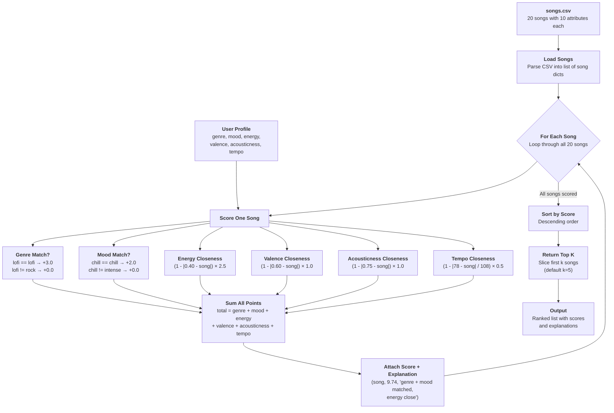

# Scoring & Recommendation Data Flow

## How a Single Song Moves Through the Pipeline

1. **Load** — A row in `songs.csv` becomes a dictionary with typed values
2. **Pair** — The song dict meets the user profile dict
3. **Score** — Six independent sub-scores are computed (2 categorical, 4 numerical)
4. **Sum** — Sub-scores combine into a single total (0.0 to 10.0)
5. **Annotate** — The total score and a human-readable explanation are attached
6. **Collect** — The scored song joins all other scored songs in a list
7. **Rank** — The list is sorted by score, highest first
8. **Select** — The top-k songs are sliced off and returned to the caller
